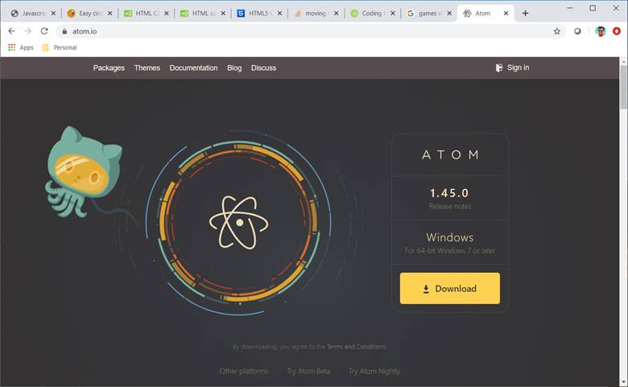
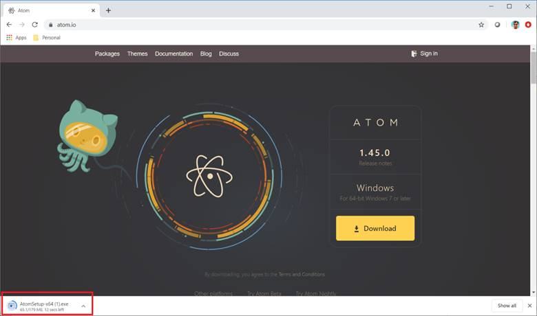
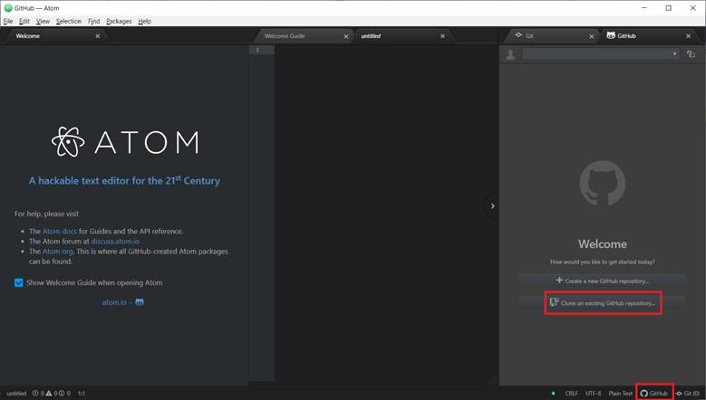
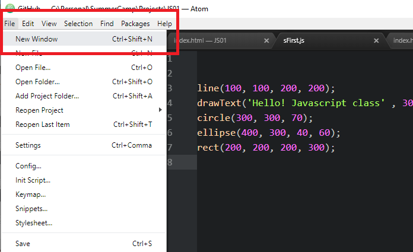
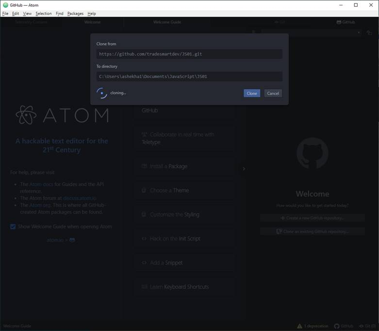

# JS01
JavaScript Basic Tutorial
1.	Download Atom editor from https://atom.io/
 

2.	Once Download is complete, run the installer. If Windows Store asks for permission, allow to execute it and select install anyway option.
 
 

3.	Click on GitHub footer icon and select “Clone an existing GitHub repository”. If you do not see this button, select File->New Window menu and in the new window try GitHub footer icon.
 
 

4.	Clone the repository from https://github.com/an-jstutorial/JS01.git to any local empty directory. For example, on Windows PC enter C:/JS01 or on Mac enter ~/Desktop/JS01
 

You should have the latest code. Go to the directory with your name in Windows Explorer and open index.html. This would show all your work going forward.
